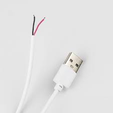
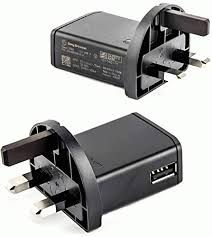
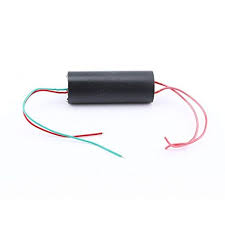

# Ionic Thruster / Corona Discharge Demo

A compact high-voltage corona discharge experiment built from a small voltage booster, a shaped steel funnel, and a cardboard base. The goal of the build is to create a smooth, focused electrode shape that encourages corona discharge at the open end while the other lead is bonded to the funnel.

## Overview

This project started as a simple hardware experiment:

- A low-voltage DC input from an old Sony Ericsson phone charger
- A small voltage booster module stepping the input up to around 20 kV
- A steel sheet formed into a funnel-like shape with a smooth leading edge
- A cardboard box used as the base and mounting platform

The high-voltage outputs from the booster are treated as two interchangeable leads. One lead is connected to the funnel-shaped metal electrode, and the other is left open with the wire ends spread apart to encourage corona discharge.

## Parts Used

| Part | Purpose |
| --- | --- |
| Cardboard box | Base and support platform |
| Steel sheet / foil | Formed into the funnel electrode |
| Voltage booster module | Steps the input voltage up to high voltage |
| Old Sony Ericsson charger | Low-voltage power source |
| Stripped USB cable | Input wiring |
| Hookup wires | High-voltage connections |

## Build Steps

### 1. Prepare the base
Use a cardboard box or any non-conductive base that can hold the components securely. Mount everything so the high-voltage section stays fixed and away from loose objects.

### 2. Shape the electrode
Take the steel sheet and form it into a smooth funnel shape. The rounded start of the funnel helps concentrate the electric field and makes corona discharge easier to observe.

### 3. Wire the low-voltage input
Connect the input side of the booster to the charger output through a stripped USB cable or equivalent low-voltage lead. Make sure the input matches the booster module’s expected supply range.

### 4. Connect the high-voltage side
Attach one high-voltage output lead to the funnel-shaped metal piece. Leave the other lead open, with the wire ends separated slightly so the electric field can break down the air at the exposed end.

### 5. Mount the booster
Secure the voltage booster module on the base and keep the wiring tidy. High-voltage modules can arc unexpectedly, so spacing and insulation matter.

### 6. Test the setup
Power the booster briefly and observe the corona discharge. In the build photo, the discharge is visible near the funnel electrode while the rest of the setup remains fixed on the base.

## How It Works

The booster raises the charger’s low-voltage input to a much higher voltage. That high voltage creates a strong electric field at the shaped metal funnel. Because the funnel has a smoother start and a concentrated geometry, the air near the edge ionizes more easily, producing corona discharge.

In this setup, the high-voltage output does not rely on polarity for the visual effect. One lead is used as the active discharge side and the other is bonded to the shaped electrode.

## Safety Notes

High voltage is dangerous even when the current seems small.

- Do not touch the output while the circuit is powered
- Keep the project away from flammable materials
- Work in a dry, clear area with good ventilation
- Disable power before moving any wire or electrode
- Expect ozone and sharp electrical odor during corona discharge
- Use insulated tools and keep bystanders away

## Suggested GitHub README Additions

If you want this repo to feel more complete, add:

- A short YouTube link once the video is published
- A wiring diagram
- A labeled parts list with exact model numbers
- A short theory section explaining corona discharge and electric field concentration
- A final results section with observations and lessons learned

## Video Placeholder

When your YouTube video is ready, add it here:

`[Watch the build video](https://youtube.com/your-video-link)`

## License

If you want, you can add a simple license for the documentation and photos, such as MIT for text and your preferred photo usage terms.
